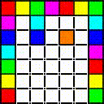

# CSE 210 "ProtoGame" Python based game

## Description of the Final Project

This class was honestly way too basic for me. It focused on object-based python. The final project was simply to make a game in python, which is a generally incredibly easy task. However, when I get an exciting idea in mind, there's no such thing as overkill. I had a partner for this class, and we had the idea to make a first person shooter in a classic wolfenstein 3D style. 

While my partner handled the game and art design, I handled all the 3D rendering and game engine design, among most of the other technicalities. This was all done on top of the Pygame 2d game engine in python, which meant that all 3d perspective rendering had to be programmed by me, which was incredibly fun to learn. I ended up making a raycast 3d rendering engine from the ground up with some inspiration from the website below. I ended up needing to do almost all the math from the ground up, but learning the basic concepts from the article was a great spring board into all of that.

[raycasting graphics tutorial](https://lodev.org/cgtutor/raycasting.html)

## My favorite part

I think that building and optimizing the raycast engine was far and away the most fun part of this process. Python is not a terribly fast programming language when it comes to very complicated tasks, so after building the first version of the ray caster, I discovered that I had tons of optimization to do if I wanted it to run at all decently. After many iterations, the main time savings were in reducing the total number of rays cast by casting rays first at the two sides of the viewport, then, if those rays hit different wall segments, it then split the difference and compared to the line to the left of it, checking again for sameness, then repeating for the right, and repeating this process of casting rays in the middle of block differences to get "close enough" to the real corners of tiles that a convincing 3d projection could be drawn, requiring far fewer total casts.

I made an animation to show visually what it is doing. It is a little simplified as there aren't as many recursions performed as in the real algorithm, so the corner finding accuracy would be probably too low to render, but it shows the general methodology. What is hard to demonstrate with this low level of recursion is how the algorithm does not send any extra rays between two rays that have hit the same tile, because obviously if they have hit the same tile, any ray cast between will also hit that same tile.

After the field of view has been fully cast, then some fun vector math among other operations can be performed to construct that 3D image data into a 2d projection which can be displayed with the PyGame renderer.

## What I would change if I did it again

Well first of all, I definitely need to get better at commenting my code for later readability. Secondly, I really would like to learn multithreading in Python far more than I have already, which is to say not terribly much. Overall, I wouldn't say that making the game itself was very fun, but I had an inordinate amount of fun creating and optimizing the raycast engine, and I would definitely learn more techniques in the future like this.