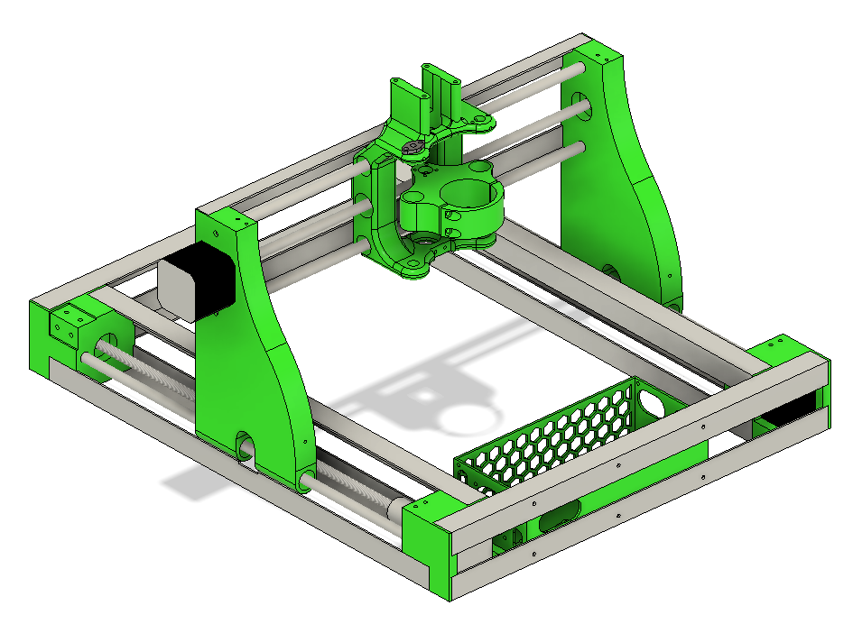

# My Custom 3D Printer - The PrintDragon

I wanted to begin milling custom PCBs, and because I'm not the biggest fan of the idea of etching them and using all those chemicals, I decided to build a custom CNC mill. To save money, I planned on using spare 3D printer parts and angled aluminum for the frame, which I believe to be the ultimate downfall of this machine. This machine had way too much backlash and runout, and was never able to mill the PCBs that I wanted accurately or with good quality. I eventually scrapped the machine, and I plan on rebuilding it at some point, but not being too cheap with the parts that it doesn't end up working.

The step file Fusion 360 archive file are available for download, but I don't recommend building it.

