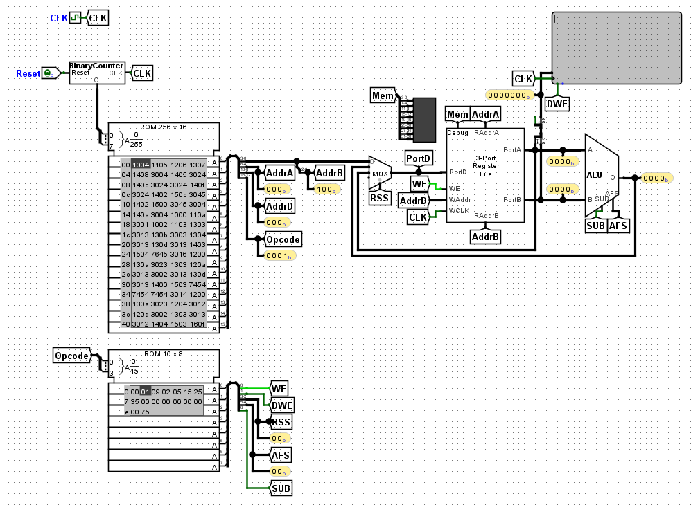
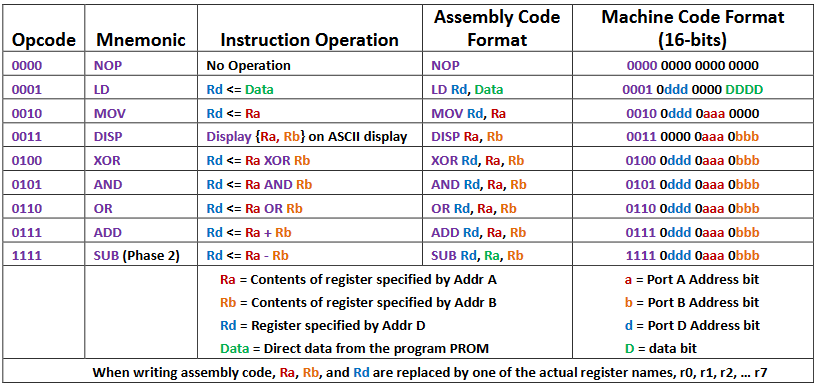
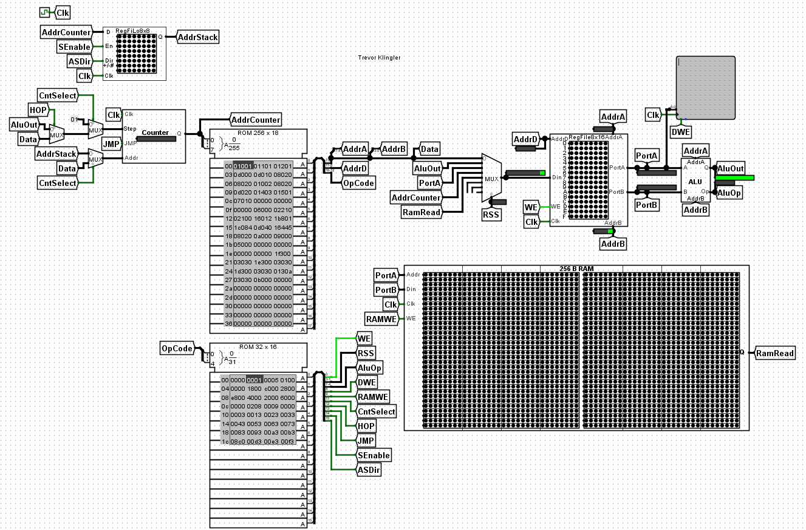
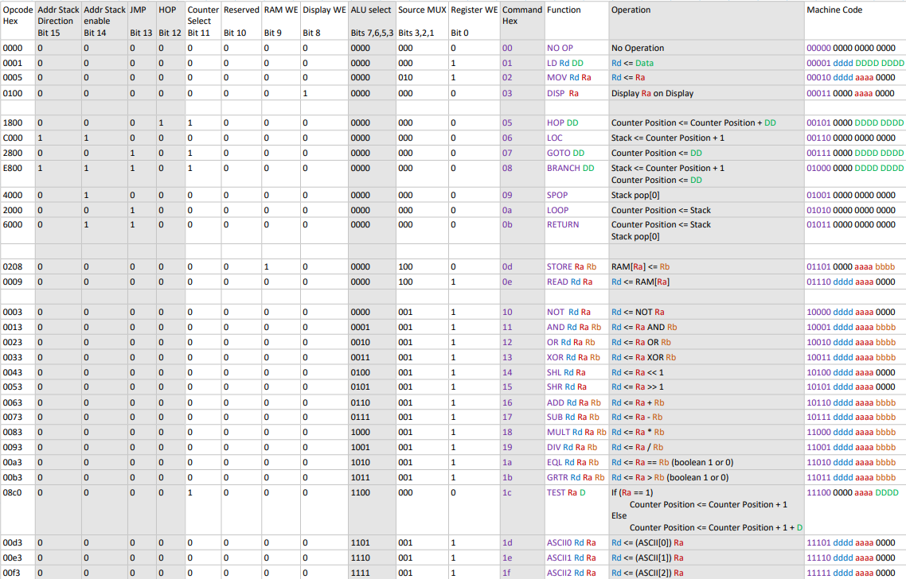
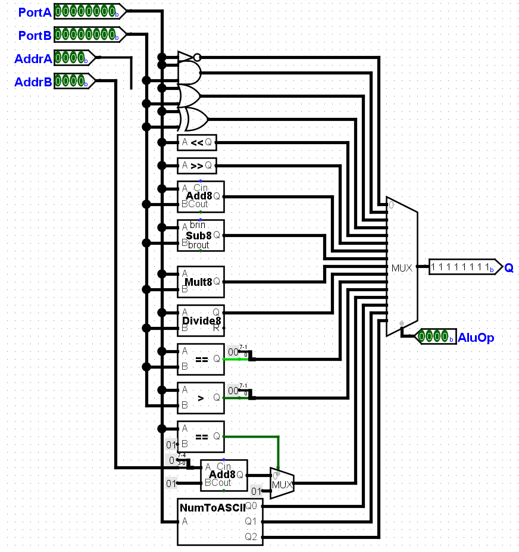
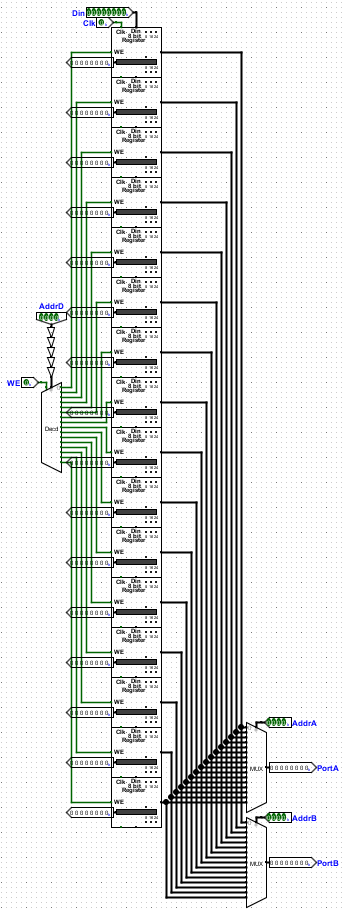
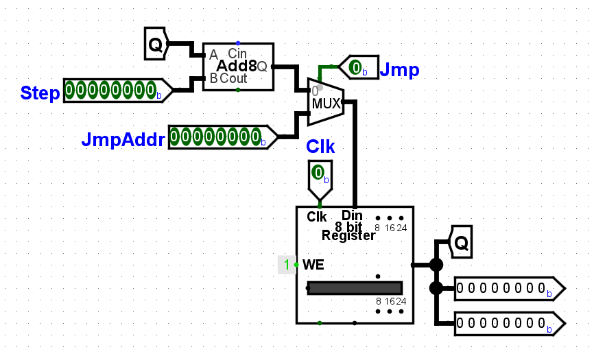

# My ECEN 160 Logisim Evolution Computer

## Description of the Final Project

This project sprung from the final of my ECEN 160 (Fundamentals of Digital Systems) course. The course focused on constructing computers from the gate level up. Just the basics, simple binary gates, gate-based memory, binary arithmetic and their construction, ETC. The project itself was not made to be overly complicated; It was to be comprised of just a 4 bit wide, 8 word register file, a basic ALU, the program counter, the Opcode decoder, and the logisim ASCII module.

| Computer overview | Opcodes |
| - | - |
|  |  |

## What I did after the project

After finishing this project, I discovered that I was having a total blast building this computer, and I started to see the potential that could be brought to this computer simulation. Namely, I wanted to expand the ALU, add RAM, make a wider and larger register file, and expand the opcodes, especially to create conditional and branching capabilities. Below are the overview and the expanded opcode table for my end result (I could have kept going, and honestly would like to, but I have to stop somewhere or it'll take over my life XD)

| Computer overview | Opcodes |
| - | - |
|  |  |

### Changes

<table>
    <tr>
        <td width=50%> Component </td>
        <td width=50%> Image </td>
    </tr>
    <tr>
        <td> ALU </td>
        <td rowspan=2>  </td>
    </tr>
    <tr>
        <td>
        The original final project only included a few operations: XOR, AND, OR, ADD, and SUB. While this is sufficient for some basic testing, The ALU needed quite a few more operations in order to achieve all that I wanted. Specifically, I wanted to add bitshifting, conditionals, and ascii-conversion capabilities.
        </td>
    </tr>
    <tr>
        <td> RAM </td>
        <td rowspan=2>  </td>
    </tr>
    <tr>
        <td>
        The original final project only has the register file for data storage, which limits any code to very small data sets and simple operations. I wanted to add RAM, so I made a tileable module in logisim that could simply be laid in a grid in another module to create the memory. In total, there are 256 bytes of RAM, which is way more than enough for any of the programs that I have made up till now.
        </td>
    </tr>
    <tr>
        <td> Register File </td>
        <td rowspan=2>  </td>
    </tr>
    <tr>
        <td>
        The original register file has 4 bit words and only 8 memory locations, for a total of 32 bits of register-based memory. Unlike the RAM, which I made simply to go overkill, this felt like a necessary upgrade. 4 bit wide memory, or in other words, a max value of 15 is incredibly limiting in almost every circumstance. I upgraded the width of the register file to a full byte each, as well as utilizing the available extra bit on the addressing lines to double the number of registers to 16 from 8, making the total storage 128 bits or simply 16 bytes. Way better to work with than before.
        </td>
    </tr>
    <tr>
        <td> New Opcodes - Branching! </td>
        <td rowspan=2>  </td>
    </tr>
    <tr>
        <td>
        The  Final project made no provision for any jumping or branching in the program, which I decided to remedy. The added opcodes allow for jumping to address, and returning from branch operations via an address stack, as well as it's accompanying control commands for popping addresses out. It overall worked out well enough, but now that I have more knowledge regarding branch operations, it looks pretty janky.
        </td>
    </tr>
</table>

## What I would change if I did it again

To start, I realize now that everything that I've added is incredibly non-standard, in addition to being a poor way of handling some things. For example, I feel like the address and data busses should be handled better and more cleanly. As it stands, it's kind of a bastard child of Von Neumann and Harvard architecture, and I would definitely ensure that I made it clearly Harvard architecture in the future, especially considering the low clock speeds.

I would also definitely pick more standard opcodes, probably from the ARM architecture. I want to be fancy here and say specifically *Thumb2*, but honestly I don't know enough ARM assembler yet to make that call. I'd definitely pick something and stick to it though.

I think that I would also make an easier interface for reading IO, to make it easier to make new future projects, more like a microcontroller.