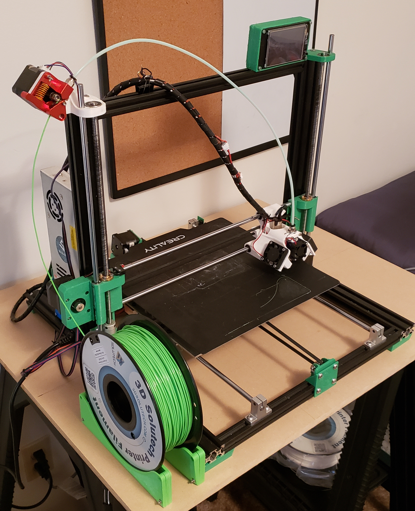
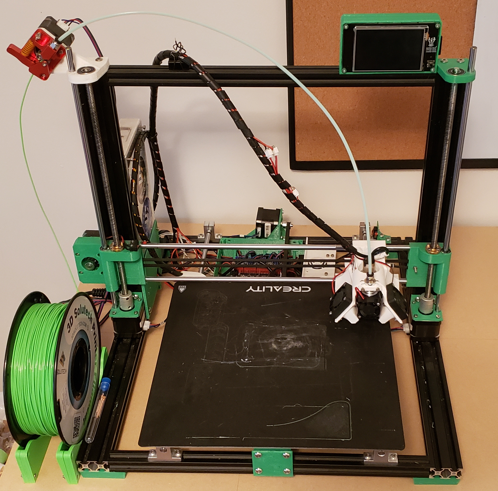

# My Custom 3D Printer - The PrintDragon

So named because I liked how it sounded, the PrintDragon is the end result of many, many, many iterations of my experience designing my own 3D printer. I got into 3D printing with a crappy, cheap Anet A8, and after having fixed every part on the machine at least once, I knew how they worked pretty well. I took all of my experience and combined it with my budding Fusion 360 skills to make, in my opinion, a very capable machine.

The step file as well as the Fusion 360 archive file are available to download, should you want to do so. I'm quite proud of them, though I realize that they're not the best.

<table>
    <tr>
        <td width=34%></td>
        <td width=33%></td>
        <td width=33%></td>
    </tr>
    <tr>
        <td></td>
        <td></td>
        <td></td>
    </tr>
</table>

## The Specs

* 310mm x 310mm x 220mm build volume
* TMC2208 stepper motor drivers
* Nema 17 stepper motors
* Dual vertical leadscrews
* Automatic mesh bed leveling via inductive sensor
* 50 Watt E3D V6 style extruder

Overall it is quite a capable machine, though it's far from perfect, and I have a couple issues with it that I would definitely need to fix on a V2.

* The bed is too low / the Z steppers are too high, the clearance between the bottom of the Z carriages and the top of the motor couplers is way too close for comfort.
* The X carriage is overall quite large. It does, on the other hand, have extremely good part cooling capabilities.
* It needs made taller. It would be cheap and easy to extend it upwards, greatly expanding the build volume for little cost. Some extra stabalization may be necessary however.
* The motherboard / case does not actually have any good attachment points to the frame. This is kind of a major oversight, but could even be easily remedied on this model with some extra 3D printed parts, aluminum extrusion, or likely what I'll do, angled aluminum.